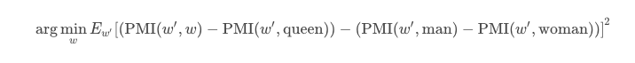

# Word Embeddings

## What are word embeddings ?

Word embedding is the collective name for a set of language modeling and feature learning techniques in natural language processing (NLP) where words or phrases from the vocabulary are mapped to vectors of real numbers. Conceptually it involves a mathematical embedding from a space with one dimension per word to a continuous vector space with much lower dimension.

## About

This repository contains scripts for playing around with the common pretrained work embedding vectors like `Fasttext` , `Glove`


## Gensim Library

A library called `Gensim` is used for the following analysis.
Gensim is a robust open-source vector space modeling and topic modeling toolkit implemented in Python. It uses NumPy, SciPy and optionally Cython for performance. Gensim is specifically designed to handle large text collections, using data streaming and efficient incremental algorithms, which differentiates it from most other scientific software packages that only target batch and in-memory processing.

## Code Explanation

### Loads the Model:
```python

en_model = KeyedVectors.load_word2vec_format('../wiki.en/wiki.en.vec')

```

### Finds similar words:
```python
for similar_word in en_model.similar_by_word(find_similar_to):
    print("Word: {0}, Similarity: {1:.2f}".format(similar_word[0], similar_word[1]))
```

### Finds analogous words:
```python
for resultant_word in en_model.most_similar(positive=positive_instance, negative=negative_instance, topn=1):
    print("Word : {0} , Similarity: {1:.2f}".format(resultant_word[0], resultant_word[1]))
```

## Vector addition and subtraction of words

### Patterns observed:
```math
Vector['king'] - Vector['man'] + vector['woman'] ≈ vector['queen']

Vector[Paris] - Vector[France] + VectorChina] ≈ Vector[Beijing]
```

### Intuition:

The idea is perhaps that vectors are approximately sums of their semantic components, so that [king] includes a "male" component as well as "ruler", "person", and whatever else, and [queen] has basically the same set of components except it has "female" instead of "male". [man] - [woman] would then end up at ["male"] - ["female"], so adding it to [king] would just swap the "male" concept for "female".

### Mathematical Idea:

Let w be a word.

We define `p(w|w')` =  probability that when we see the word w, another word w′ shows up nearby .

Then:
`p(w′|king) / p(w′|queen) ≈ p(w′|man) / p(w′|woman)`

So finding a word w such that,
`w is to queen as man is to woman` becomes an optimization problem:

Find a w that minimizes:


The optimization problem can be rewritten as:



Using the pointwise mutual information, which measures how strongly associated two events are.

## Outputs for vaiours tests:

### Similarity list

* Word Provided as input

```python
find_similar_to = 'dog'
```
Output:

| word|Similarity|
|--------|:---------:
 dogs |  0.81                                                  
 puppy |  0.70                                               
 sheepdogs |  0.69                                             
 dachshund |  0.69                                             
 sheepdog |  0.68                                              
 puppies |  0.68                                               
 poodle |  0.68                                                
 chickenhound |  0.67                                       
 coonhound |  0.66                                             
 doberman |  0.66

* Vector Similarity using addition and subtraction:

```python
positive_instance = ['woman', 'king']
negative_instance = ['man']
```

Output:

|word|Similarity|
|--|:--:
queen | 0.66
princess | 0.58
pregnant | 0.58                                         
princesses | 0.56                                           
consort | 0.54                                          
regnants | 0.53                                             
queenmother | 0.52                                          
princess | 0.50                                            
parmaprincess | 0


   